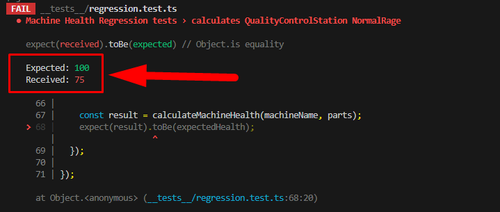
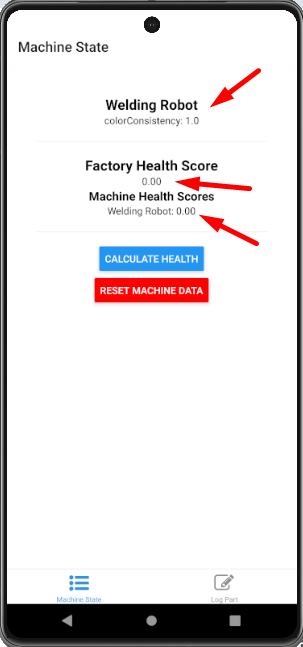
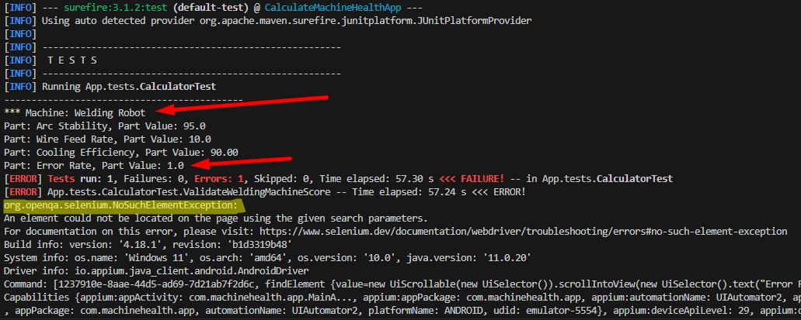

# BellSant Machine Health Tests

## Test Scenarios for the API:

For the Calculate Tests I separated the test in two groups:
* one for a specific Machine Part of each machine, which I chose as an important part for the machine
* another group for each part of each machine

I also created a regression Test to assure that all machine parts meets the normal range values and health score of 100


### Problems Found in the API:

*   Machine: Quality Control Station: 

The configuration for the Software Version Part has characters in the values (see code bellow) and it is interferieng on the final health score, if all part values have the maximum normalRange Vaue, the total score is returning 75.00 instead of 100.00. 

```
"softwareVersion": {
      "normalRange": ["v1.0", "v2.0"],
      "abnormalRange": ["v2.1", "v3.0"],
      "optimalRange": ["v1.0", "v2.0"]
    },
```

because this, the regression scenario "calculates QualityControlStation NormalRage" is failling:




## Test Scenarios for the Mobile App:

This automation was made to validate the calculation on the mobile app

For the Calculate Tests I created scenarios to validate all machine and it's parts with some values to validate the score calculated.

After each test, a screenshot is saved on the folder java > target > screenshots


### Problems Found in the APP:

On the Log parts screen, after selecting a machine, the list of parts names does not update with the parts of the selected machine, the list shows all available parts, causing some problems in finding the correct part and allowing us to select a non-existent part for the machine. . returning incorrect health scores



Another problem is that WeldingRobot ErrorRate Part isn't listed in the Part Name List and because that, the scenario ValidateWeldingMachineScore is failling with <i>org.openqa.selenium.NoSuchElementException</i>:

