# Java MachineHealth Mobile Automation

This is a mobile automation for the app MachineHealth application, it was made in Java, due the time of the challenge, since I'm not very familiar with typescript language for mobile automation.

## System Requirements:

- JDK 11
- Maven
- Android Studio
- Appium
 

## Installation

Follow these steps to set up the java automation for the mobile app:

1. Navigate to the java project directory:

   ```bash
   cd java
   ```

2. Install maven dependencies:

   ```bash
   mvn clean install
   ```


## Usage


### setting up the the mobile virtual device:

* Create a virtual device within android Studio Virtual Device Manager
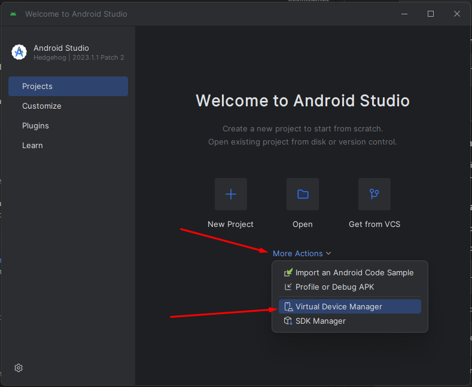

* click on "+" on the Device Manager window:
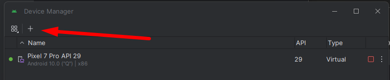

* choose any device from the list and click Next:
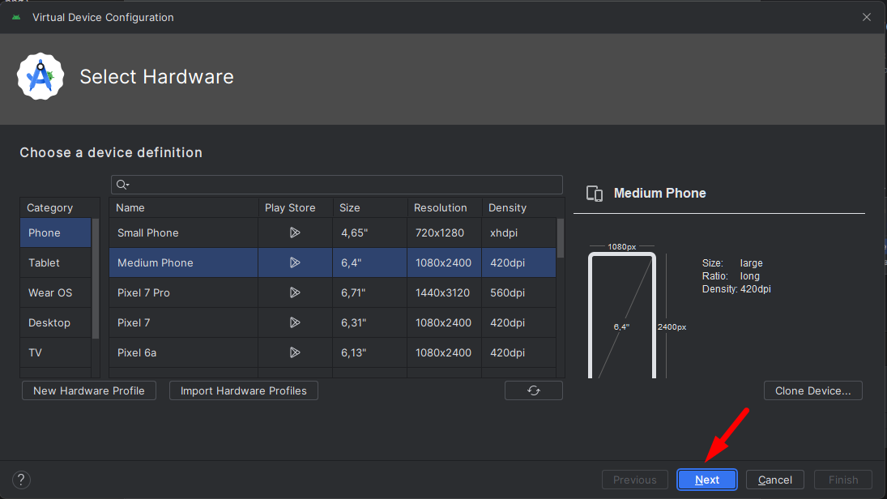

* Select a android image and click Next (it will automatically download if needed)
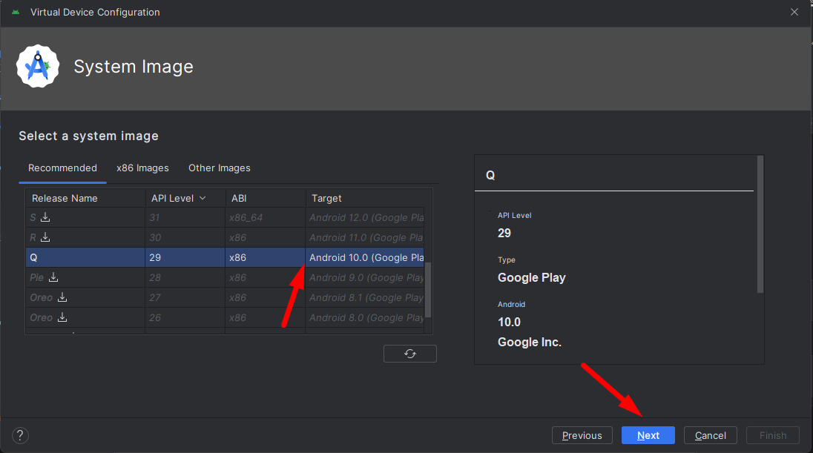

*   Define a name for the device and click finish:
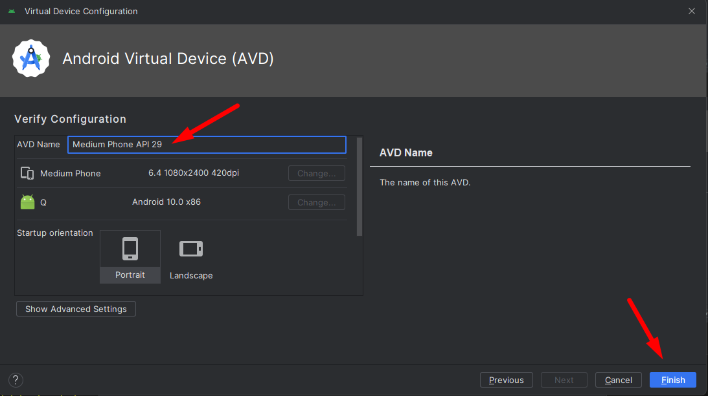

*   the new Device will show up in the device manager List:
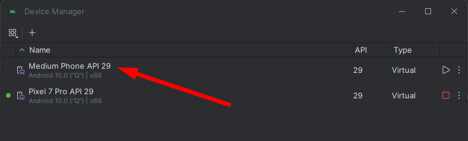

You can now Close the Adnroid Studio Aplication.

### Starting the mobile aplication from command line:

1. Run the Emulator:

*  To  start the device:
```bash
    emulator @<name of the device>
```

*   if you need to get the name of the device use the comand bellow:
```bash
    emulator -list-avds
```

2. Then run the appium server with the following command:

```bash
    appium
```

3. Get the name of the device using the command:
```bash
    adb devices
```
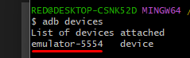

*   Then copy the device name in to located in class CalculatorTest.java:
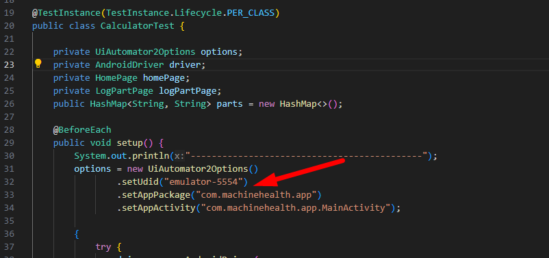


4. Then run the automation with the command:
```bash
    mvn clean test
```

*   For each machine, a test of each machine will be executed, assuring that the final score is correct
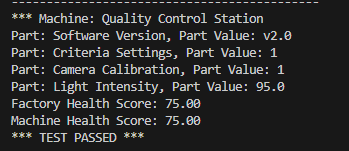

*   at the end of the execution an resume will be displayed:
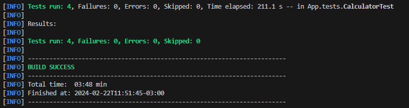

*   a Evidence screenshot of the final screen for each test will be saved in the folder java > target > screenshots
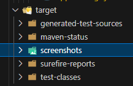